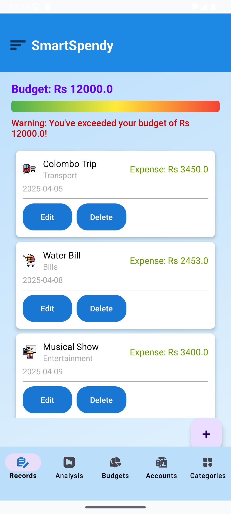
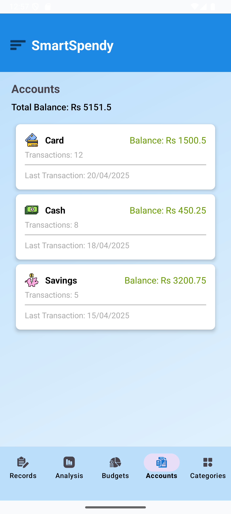
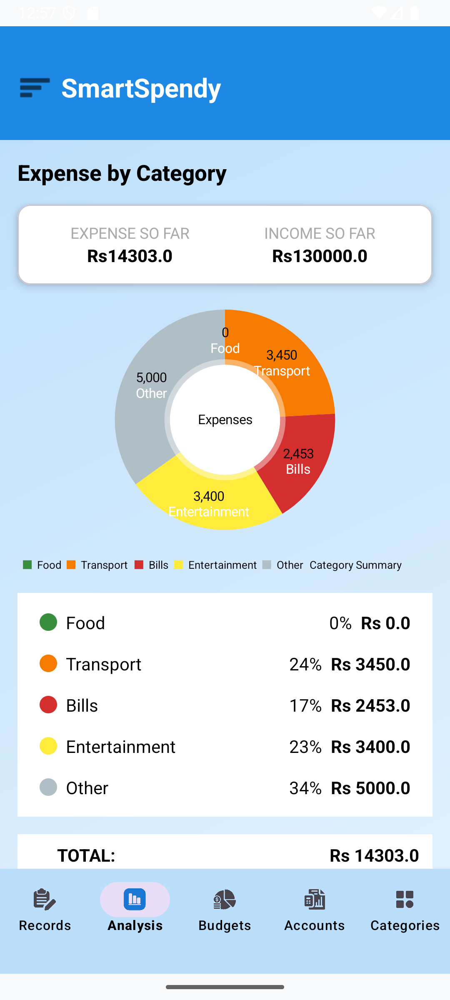
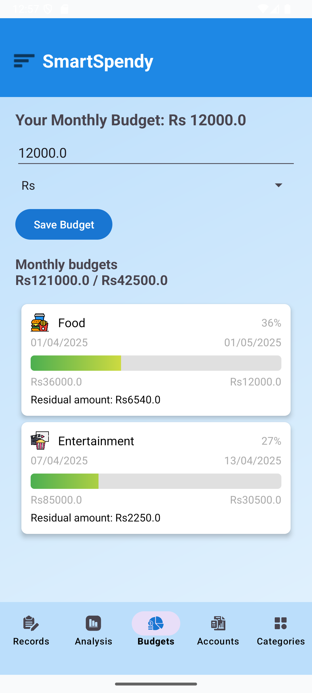
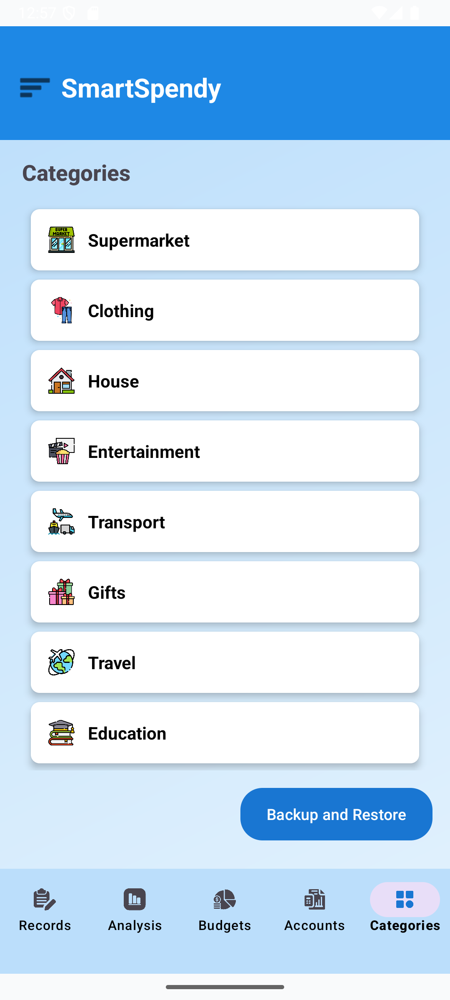

# 💰 SmartSpendy – Personal Finance Tracker


> **SmartSpendy** is a simple, intuitive, and efficient personal finance tracking app built with **Kotlin** in **Android Studio**.  
It helps users track income, expenses, savings, and budgets — all in one place.

## 📥 Download the APK (Sideload)
- Latest APK:
  <p align="left"> <a href="https://github.com/Kaleshi26/SmartSpendy_App/tree/master/releases">  </a> </p>
  - Direct link: https://github.com/Kaleshi26/SmartSpendy_App/tree/master/releases/app-release.apk
- Install on Android:
  - Download the APK on your phone.
  - Tap to install → allow “Install unknown apps” when prompted → Install.
  - You may see a Play Protect warning since it’s not from the Play Store.


## ✨ Features

### 📌 Core Features
- **Transaction Management**
  - Add, edit, or delete income and expense entries.
  - Store title, amount, category, and date for each transaction.
  
- **Category-wise Spending**
  - Organize expenses into categories (Food, Bills, Transport, etc.).
  - View category summaries to identify major spending areas.
  
- **Monthly Budget Setup**
  - Set and track monthly budgets.
  - Receive alerts when nearing or exceeding the budget.

- **Data Persistence**
  - Store user preferences & transaction history using **SharedPreferences**.
  - Data is retained even after app restarts.


### 🎁 Bonus Features
- **Data Backup & Restore**
  - Export transactions to JSON or text files.
  - Restore data from saved backups.

- **Push Notifications**
  - Get budget alerts and daily reminders to log expenses.


## 🛠 Tech Stack
- **Language:** Kotlin  
- **IDE:** Android Studio  
- **Storage:** SharedPreferences & Internal Storage  
- **Backup Format:** JSON / Text Files  
- **UI:** XML Layouts with custom styling


## 📲 How It Works
1. **Add Transactions** → Log income or expenses with details.  
2. **Categorize & Track** → Organize spending into categories.  
3. **Set Budget** → Define a monthly spending limit.  
4. **Get Alerts** → Notifications when budget is close to limit.  
5. **Backup Data** → Export & restore your financial records anytime.

👨‍💻 Author
M.K.E Dharmarathne – Mobile Application Development Lab Project (SLIIT, Year 2)


## 🚀 Installation
1. Clone the repository:
```bash
git clone https://github.com/your-username/SmartSpendy.git
Open in Android Studio.
Sync Gradle & run on an emulator or Android device.
```

## 📸 Screenshots

<p align="center">
  
  
  
</p>
<p align="center">
  
  
  
  
</p>
